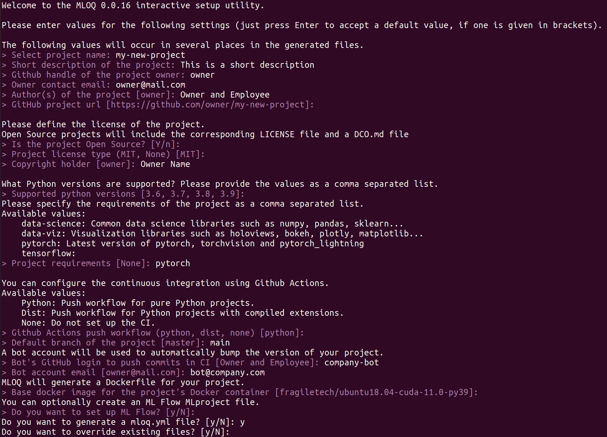

# ML Ops Quickstart
[](https://mloq.readthedocs.io/en/latest/?badge=latest)
[](https://codecov.io/github/fragiletech/ml-ops-quickstart)
[](https://pypi.org/project/mloq/)
[](https://github.com/ambv/black)
[](https://opensource.org/licenses/MIT)

ML Ops Quickstart is a tool for initializing Machine Learning projects following ML Ops best practices.

Setting up new repositories is a time-consuming task that involves creating different files and 
configuring tools such as linters, docker containers and continuous integration pipelines. 
The goal of `mloq` is to simplify that process, so you can start writing code as fast as possible.

`mloq` generates customized templates for Python projects with focus on Maching Learning. An example of 
the generated templates can be found in [mloq-template](https://github.com/FragileTech/mloq-template).

## [1.](#Index) Installation

`mloq` is tested on Ubuntu 18.04+, and supports Python 3.6+.

### Install from pypi
```bash
pip install mloq
```
### Install from source
```bash
git clone https://github.com/FragileTech/ml-ops-quickstart.git
cd ml-ops-quickstart
pip install -e .
```

## [2.](#Index) Usage
### [2.1](#Index) Command line interface

Options:
* `--file` `-f`: Name of the configuration file. If `file` it's a directory it will load the `mloq.yml` file present in it.

* `--override` `-o`: Rewrite files that already exist in the target project.
* `--interactive` `-i`: Missing configuration data can be defined interactively from the CLI.

#### Usage examples
Arguments:
* `OUTPUT`: Path to the target project.

To set up a new repository from scratch interactively in the curren working directory:
```bash
mloq setup -i .
```

To load a `mloq.yml` configuration file from the current repository, and initialize the directory `example`, and 
override all existing files with no interactivity:
```bash
mloq setup -f . -o example
```



## [5.](#Index) License
ML Ops Quickstart is released under the [MIT](LICENSE) license.

## [6.](#Index) Contributing

Contributions are very welcome! Please check the [contributing guidelines](CONTRIBUTING.md) before opening a pull request.

## [7.](#Index) Roadmap

- [ ] Improve documentation and test coverage.
- [ ] Configure sphinx to build the docs automatically.
- [ ] Expose all api as a CLI interface
- [ ] Add new customization options.