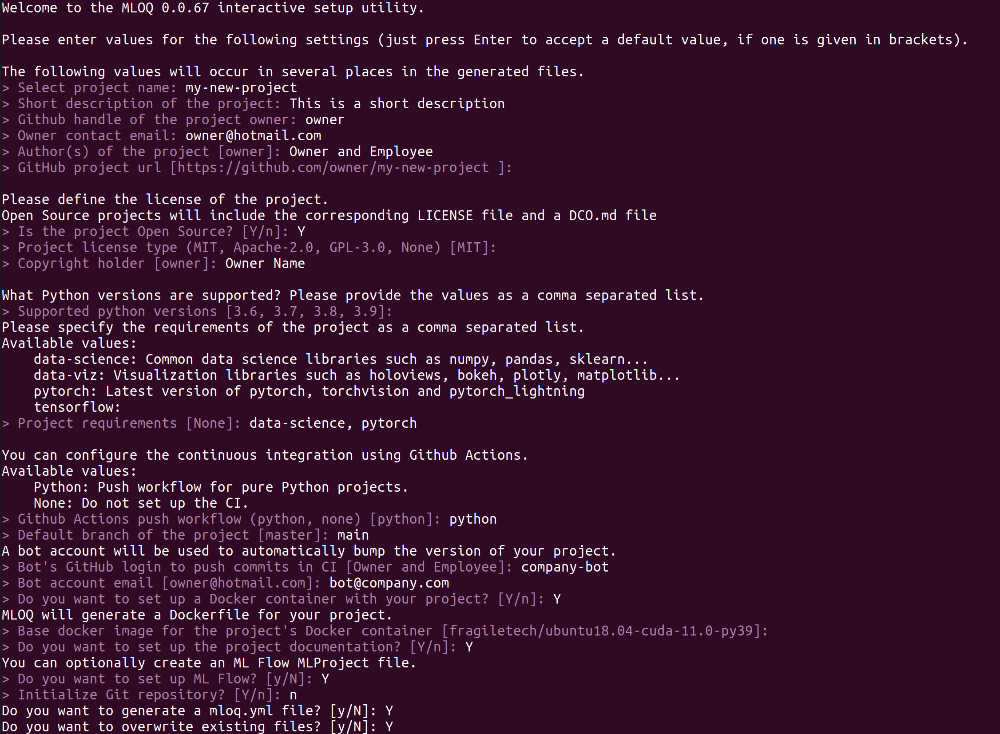

# ML Ops Quickstart
[](https://mloq.readthedocs.io/en/latest/?badge=latest)
[](https://codecov.io/github/fragiletech/ml-ops-quickstart)
[](https://pypi.org/project/mloq/)
[](https://github.com/ambv/black)
[](https://opensource.org/licenses/MIT)

ML Ops Quickstart is a tool for initializing Machine Learning projects following ML Ops best practices.

Setting up new repositories is a time-consuming task that involves creating different files and 
configuring tools such as linters, docker containers and continuous integration pipelines. 
The goal of `mloq` is to simplify that process, so you can start writing code as fast as possible.

`mloq` generates customized templates for Python projects with focus on Maching Learning. An example of 
the generated templates can be found in [mloq-template](https://github.com/FragileTech/mloq-template).

## [1.](#Index) Installation

`mloq` is tested on Ubuntu 18.04+, and supports Python 3.6+.

### Install from pypi
```bash
pip install mloq
```
### Install from source
```bash
git clone https://github.com/FragileTech/ml-ops-quickstart.git
cd ml-ops-quickstart
pip install -e .
```

## [2.](#Index) Usage
`mloq` has three modules or _commands_ that allows the user to generate the files and tools he requires 
to configure the project according to his needs and preferences: 
* `mloq setup` is the main command of `mloq`. It generates __all__ the necessary files for a Machine Learning project. 
* `mloq docs` creates the required __documentation__ files for the project. 
* `mloq package` sets the __root__ files of the project. Optionally, this command allows the user to define a __Docker__ 
container as well as MLFlow configuration file. 

### [2.1](#Index) Command line interface

All three previous commands offers different __options__ to customize the user experience:
* `--file` `-f`: Specify the path containing the `mloq.yml` configuration file of the project. 
If `file` it's a directory, it will load the _mloq.yml_ file present in it. 
* `--interactive` `-i`: Configure the project package interactively. Missing configuration data can 
be defined interactively from the CLI.
* `--overwrite` `-o`: Rewrite files that already exist in the target project.
* `--help`: Show the documentation page of the command. 

:::{admonition} 
:class: tip
When starting a ML project for the first time, it is advisable to initialize it using the __interactive__ mode. 
This option will assist the user through a step-by-step process to generate the required files.
:::

#### Usage examples
We can either use the interactive mode or load a `mloq.yml` configuration file to build the structure
of the project: 
* To set up a new repository from scratch following the interactive step-by-step guide in the current 
working directory:
```bash
mloq setup -i .
```

* To load a `mloq.yml` configuration file from the current repository, and initialize the directory `/home/user/example`:
```bash
mloq setup -f mloq.yml /home/user/example 
```

* To load a `mloq.yml` configuration file from the `/home/user/container/` folder, initialize
the directory `/home/user/overwrite`, and overwrite all existing files with no interactivity: 
```bash
mloq setup -f /home/user/container/mloq.yml -o /home/user/overwrite 
```

#### Interactive mode 
When using the interactive option, `mloq` will prompt the user to enter a series of values in order to generate
the necessary folders, tools and files of the project:
```bash
mloq setup -i .
```
```
Welcome to the MLOQ 0.0.67 interactive setup utility.

Please enter values for the following settings (just press Enter to accept a default value, if one is given in brackets).

The following values will occur in several places in the generated files.
> Select project name: my-new-project 
> Short description of the project: This is a short description
> Github handle of the project owner: owner
> Owner contact email: owner@hotmail.com
> Author(s) of the project [owner]: Owner and Employee
> GitHub project url [https://github.com/owner/my-new-project ]: 

Please define the license of the project. 
Open Source projects will include the corresponding LICENSE file and a DCO.md file
> Is the project Open Source? [Y/n]: Y
> Project license type (MIT, Apache-2.0, GPL-3.0, None) [MIT]: 
> Copyright holder [owner]: Owner Name

What Python versions are supported? Please provide the values as a comma separated list. 
> Supported python versions [3.6, 3.7, 3.8, 3.9]: 
Please specify the requirements of the project as a comma separated list.
Available values:
    data-science: Common data science libraries such as numpy, pandas, sklearn...
    data-viz: Visualization libraries such as holoviews, bokeh, plotly, matplotlib...
    pytorch: Latest version of pytorch, torchvision and pytorch_lightning
    tensorflow: 
> Project requirements [None]: data-science, pytorch

You can configure the continuous integration using Github Actions.
Available values:
    Python: Push workflow for pure Python projects.
    None: Do not set up the CI.
> Github Actions push workflow (python, none) [python]: python
> Default branch of the project [master]: main
A bot account will be used to automatically bump the version of your project.
> Bot's GitHub login to push commits in CI [Owner and Employee]: company-bot
> Bot account email [owner@hotmail.com]: bot@company.com
> Do you want to set up a Docker container with your project? [Y/n]: Y
MLOQ will generate a Dockerfile for your project.
> Base docker image for the project's Docker container [fragiletech/ubuntu18.04-cuda-11.0-py39]: 
> Do you want to set up the project documentation? [Y/n]: Y
You can optionally create an ML Flow MLProject file.
> Do you want to set up ML Flow? [y/N]: Y
> Initialize Git repository? [Y/n]: n
Do you want to generate a mloq.yml file? [y/N]: Y
Do you want to overwrite existing files? [y/N]: Y

```


## [5.](#Index) License
ML Ops Quickstart is released under the [MIT](LICENSE) license.

## [6.](#Index) Contributing

Contributions are very welcome! Please check the [contributing guidelines](CONTRIBUTING.md) before opening a pull request.

## [7.](#Index) Roadmap

- [ ] Improve documentation and test coverage.
- [ ] Configure sphinx to build the docs automatically.
- [ ] Expose all api as a CLI interface
- [ ] Add new customization options.