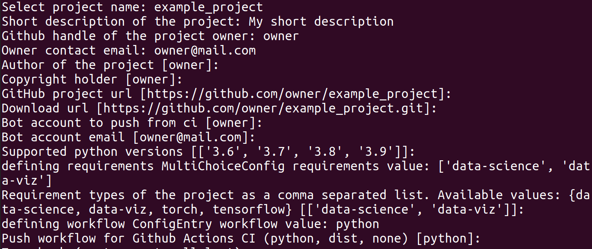
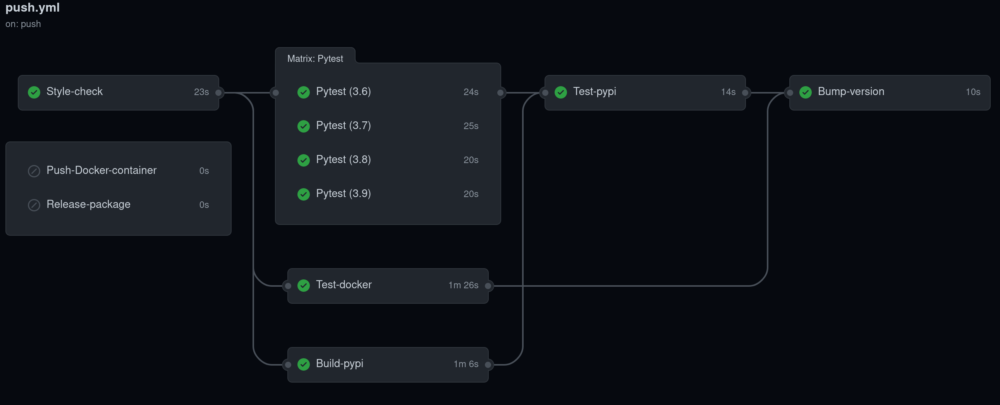

# ML Ops Quickstart
[](https://codecov.io/github/fragiletech/ml-ops-quickstart)
[](https://pypi.org/project/mloq/)
[](https://hub.docker.com/r/fragiletech/mloq/tags)
[](https://github.com/ambv/black)
[](https://opensource.org/licenses/MIT)

ML Ops Quickstart is a tool for initializing Machine Learning projects following ML Ops best practices.

Setting up new repositories is a time-consuming task that involves creating different files and 
configuring tools such as linters, docker containers and continuous integration pipelines. 
The goal of `mloq` is to simplify that process, so you can start writing code as fast as possible.

`mloq` generates customized templates for Python projects with focus on Maching Learning. An example of 
the generated templates can be found in [mloq-template](https://github.com/FragileTech/mloq-template).

## Index
1. **[Installation](#1-installation)**
   
2. **[Usage](#2-usage)**
    * **[2.1 Command line interface](#21-command-line-interface)**
    * **[2.2 mloq.yml config file](#22-mloqyml-config-file)**

3. **[Features](#3-features)**
    * **[3.1 Repository files](#31-repository-files)**
    * **[3.2 Packaging](#32-packaging)** 
    * **[3.3 Code style](#33-code-style)**
    * **[3.4 Requirements](#34-requirements)**
    * **[3.5 Docker](#35-docker)**
    * **[3.6 Continuous integration](#36-continuous-integration-using-github-actions)**
    * **[3.7 Testing](#37-testing)**
    
4. **[Project Makefile](#3-project-makefile)**    
5. **[License](#4-license)**
6. **[Contributing](#6-contributing)**
7. **[Roadmap](#7.-roadmap)**


## [1.](#Index) Installation

`mloq` is tested on Ubuntu 18.04+, and supports Python 3.6+.

### Install from pypi
```bash
pip install mloq
```
### Install from source
```bash
git clone https://github.com/FragileTech/ml-ops-quickstart.git
cd ml-ops-quickstart
pip install -e .
```

## [2.](#Index) Usage
### [2.1](#Index) Command line interface

To set up a new repository from scratch interactively in the curren working directory:
```bash
mloq quickstart .
```

To load a configuration file from the current repository and initialize the directory `example`, and 
override all existing files:
```bash
mloq quickstart -f . -o example
```

Options:
* `--file` `-f`: Name of the configuration file. If `file` it's a directory it will load the `mloq.yml` file present in it.

* `--override` `-o`: Rewrite files that already exist in the target project.

Arguments:
* `OUTPUT`: Path to the target project.



### [2.2](#Index) mloq.yml config file

This yaml file contains all the information used by mloq to set up a new project.
All values are strings except **python_versions** and **requirements**,
that are lists of strings. **null** values are interpreted as missing values.
```yaml

# `template` contains all the values that will be written in the generated files.
# They are loaded as a dictionary and passed to jinja2 to fill in the templates.
template: 
  project_name: null  # Name of the new Python project
  owner: null  # ------- Github handle of the project owner
  author: null # Person or entity listed as the project author in setup.py
  email: null  # Owner contact email
  copyright_holder: null # Owner of the project's copyright.
  project_url: null # GitHub project url. Defaults to https://github.com/{owner}/{project_name}
  download_url: null # Download link
  bot_name: null # Bot account to push from ci when bumping the project's version
  bot_email: null # Bot account email
  license: "MIT" # Currently only MIT license is supported
  description: "example_description" # Short description of the project
  python_versions: ['3.6', '3.7', '3.8', '3.9'] # Supported Python versions
  default_branch: "master" # Name of the default git branch of the project

requirements: ["datascience", "pytorch", "dataviz"]

# workflows:
# "dist" for python packages with compiled extensions
# "python" for pure python packages.
workflow: "python"
```

## [3.](#Index) Features

### [3.1](#Index) Repository files
Set up the following common repository files personalized for your project with the values
defined in `mloq.yml`:

- README.md
- DCO.md
- CONTRIBUTING.md
- code_of_conduct.md
- LICENSE
- .gitignore

### [3.2](#Index) Packaging

Automatic configuration of `pyproject.toml` and `setup.py` to distribute your project as a Python package.

### [3.3](#Index) Code style
All the necessary configuration for the following tools is defined in [pyproject.toml](mloq/assets/templates/pyproject.toml).
- [black](https://black.readthedocs.io/en/stable/?badge=stable): Automatic code formatter.
- [isort](https://pycqa.github.io/isort/): Rearrange your imports automatically.
- [flakehell](https://flakehell.readthedocs.io/): Linter tool build on top of `flake8`, `pylint` and `pycodestyle`

### [3.4](#Index) Requirements
`mloq` creates three different requirements files in the root directory of the project. Each file contains 
pinned dependencies.

- [requirements-lint.txt](mloq/assets/requirements/requirements-lint.txt): 
Contains the dependencies for running style check analysis and automatic formatting of the code.
  
- [requirements-text.txt](mloq/assets/requirements/requirements-test.txt):
Dependencies for running pytest, hypothesis and test coverage.
  
- `requirements.txt`: Contains different pre-configured dependencies that can be defined in `mloq.yml`. The available pre-configured dependencies are:
   * [data-science](mloq/assets/requirements/data-science.txt): Dependencies of common data science libraries.
   * [data-visualization](mloq/assets/requirements/data-visualization.txt): Common visualization libraries.
   * Last version of [pytorch](mloq/assets/requirements/pytorch.txt) and [tensorflow](mloq/assets/requirements/tensorflow.txt)
   
### [3.5](#Index) Docker

A [Dockerfile](mloq/assets/templates/Dockerfile) that builds a container on top of the FragileTech [Docker Hub]() images:
- If *tensorflow* or *pytorch* are selected as requirements the container has CUDA 11.0 installed.
- Installs all the packages listed in `requirements.txt`.
- Installs `requirements-test.txt` and `requirements-lint.txt` dependencies.
- Install a `jupyter notebook` server with a configurable password in the port 8080.
- Installs the project with `pip install -e .`.

### [3.6](#Index) Continuous integration using GitHub Actions
Set up automatically a continuous integration (CI) pipeline using GitHub actions with the following jobs:


Automatic build and tests:

- **Style Check**: Run `flake8` and `black --check` to ensure a consistent code style.
- **Pytest**: Test the project using pytest on all supported Python versions and output a code coverage report.
- **Test-docker**: Build the project's Docker container and run the tests inside it.
- **Build-pypi**: Build the project and upload it to [Test Pypi](https://test.pypi.org/) with a version tag unique to each commit.
- **Test-pypi**: Install the project from Test Pypi and run the tests using pytest.
- **Bump-version**: Automatically bump the project's version and create a tag in the repository every time the default branch is updated.

Deploy each new version:
- **Push-docker-container**: Upload the project's Docker container to [Docker Hub](https://hub.docker.com/).
- **Release-package**: Upload to [Pypi](https://pypi.org/) the source of the project and the corresponding wheels.

### [3.7](#Index) Testing
The lasts versions of `pytest`, `hypothesis` and `pytest-cov` can be found in `requirements-test.txt`.

The folder structure for the library and tests is created. A `scripts` folder containing the scripts
that will be run in the CI will also be created on the root folder of the project.

## [4.](#Index) Project Makefile
A `Makefile` will be created in the root directory of the project. It contains the following commands:

- `make style`: Run `isort` and `black` to automatically arrange the imports and format the project.
- `make check`: Run `flakehell` and check black style. If it raises any error the CI will fail.
- `make test`: Clear the tests cache and run pytest.
- `make pipenv-install`: Install the project in a new Pipenv environment and create a new `Pipfile` and `Pipfile.lock`.
- `make pipenv-test`: Run pytest inside the project's Pipenv.
- `make docker-build`: Build the project's Docker container.
- `make docker-test`: Run pytest inside the projects docker container.
- `make docker-shell`: Mount the current project as a docker volume and open a terminal in the project's container.
- `make docker-notebook`: Mount the current project as a docker volume and open a jupyter notebook in the project's container. 
  It exposes the notebook server on the port `8080`.

## [5.](#Index) License
ML Ops Quickstart is released under the [MIT](LICENSE) license.

## [6.](#Index) Contributing

Contributions are very welcome! Please check the [contributing guidelines](CONTRIBUTING.md) before opening a pull request.

## [7.](#Index) Roadmap

- [ ] Improve documentation and test coverage.
- [ ] Configure sphinx to build the docs automatically.
- [ ] Implement checks for additional best practices.
- [ ] Improve command line interface and logging.
- [ ] Add new customization options.